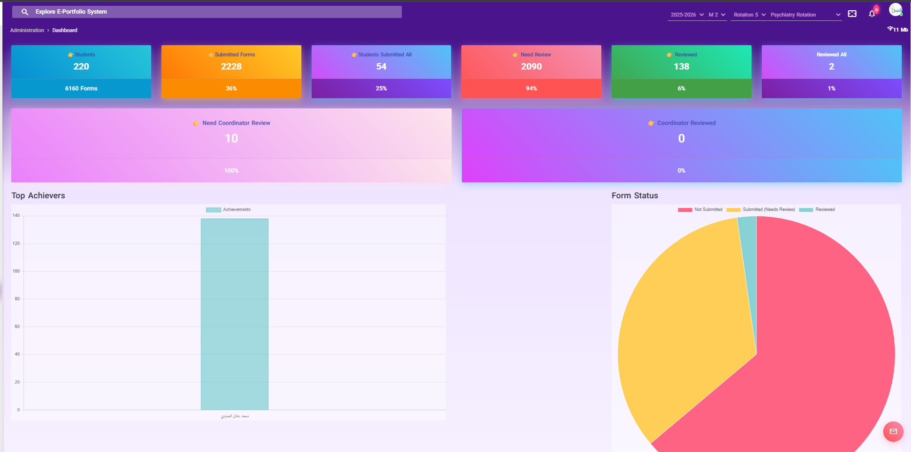

# Eportfolio
# Eportfolio - Medical Student Case Tracking System

Eportfolio is a **web application for medical students** before graduation, designed to track patient cases, clinical rotations, and evaluations across all medical specialties. Supervisors and program directors can review, evaluate, and approve student submissions. The system also supports **dynamic clinical sheets, student progression, and case archiving**.

---

## Overview
**Industry:** Healthcare / Medical Education  
**Role:** Principal Software Engineer & Backend Architect  
**Users:** Medical students, clinical supervisors, program directors  

### Business Problem
Medical schools faced challenges in:
- Tracking clinical cases per student across multiple specialties  
- Reviewing and approving cases efficiently by supervisors and program directors  
- Recording dynamic clinical sheets and evaluations  
- Managing student progression and graduation requirements  

---

## Key Features
- Student case registration and tracking across all medical specialties  
- Dynamic clinical sheets with customizable fields per rotation  
- Supervisor and program director review workflow  
- Student evaluations and scoring  
- Archiving and progression management for graduating students  
- Reports and analytics on student performance and case completion  
- Notifications for pending reviews and approvals  

---

## Architecture & Technologies
- **Backend:** Django, Django REST Framework (DRF)  
- **Async / Tasks:** Celery for background processing and notifications  
- **Database:** MySQL  
- **Frontend:** Vue.js + Bootstrap (dynamic forms and dashboards)  
- **Infrastructure / Deployment:** AWS EC2, S3, RDS  
- **CI/CD:** GitHub Actions, Docker  

>   
> *Placeholder for system architecture diagram*

---

## Key Achievements
- Developed a **modular and scalable system** to track medical student cases across multiple specialties  
- Implemented **dynamic clinical sheets** supporting variable fields per specialty  
- Built **review and approval workflows** for supervisors and program directors  
- Automated **student progression and archiving** for graduation readiness  
- Designed **reporting dashboards** to monitor performance and compliance  

---

## Impact
- Streamlined clinical case tracking for medical students  
- Reduced manual administrative tasks by 50%  
- Enabled **transparent review process** and consistent student evaluations  
- Scalable for multiple cohorts and specialties  

---

## Screenshots / Demo
>   
> *Placeholder for Eportfolio dashboard screenshot*

---

## Note on Source Code
This project is enterprise-grade and protected under NDA.  
Source code cannot be shared publicly, but architecture, workflows, and system design can be discussed.

---

## Contact
📧 ahmedbarakatsamra@gmail.com  
🔗 [LinkedIn](https://linkedin.com/in/ahmed-barakat-dev)  
🔗 [GitHub](https://github.com/ahmedbarakat)
